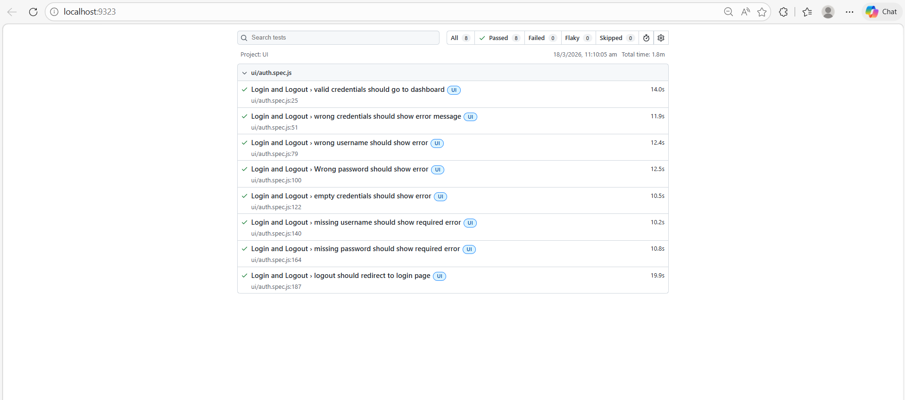
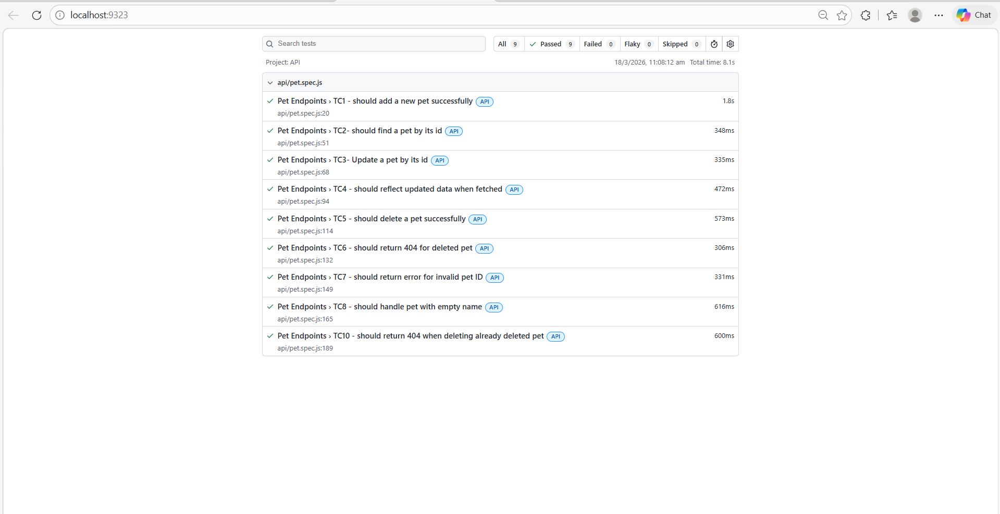
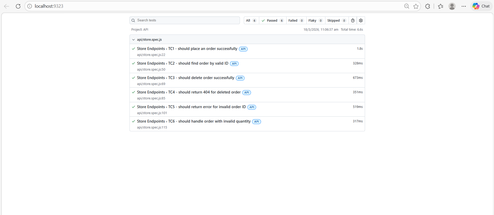

# Playwright Automation Framework

UI and API test automation framework built with Playwright and JavaScript.

---

## What is tested

### UI Tests — OrangeHRM (https://opensource-demo.orangehrmlive.com)
| Module | Tests |
|---|---|
| Login and Logout | 7 test cases |
| Employee PIM Module | 11 test cases |

### API Tests — PetStore (https://petstore.swagger.io)
| Module | Tests |
|---|---|
| Pet Endpoints | 10 test cases |
| Store Endpoints | 6 test cases |

---

## Project Structure
```
playwright-framework/
├── tests/
│   ├── ui/
│   │   ├── auth.spec.js        ← Login/Logout tests
│   │   └── employee.spec.js    ← PIM module tests
│   └── api/
│       ├── pet.spec.js         ← Pet endpoint tests
│       └── store.spec.js       ← Store endpoint tests
├── pages/
│   ├── LoginPage.js            ← Page Object for login
│   └── EmployeePage.js         ← Page Object for PIM
├── test-data/
│   └── testData.js             ← All test data in one place
├── utils/
│   └── helpers.js              ← Logging and error handling
├── reports/                    ← HTML test execution reports
├── playwright.config.js        ← Playwright configuration
└── README.md
```

---

## Setup Instructions

### Step 1 — Install Node.js
Download LTS version from https://nodejs.org

Verify installation:
```bash
node --version
npm --version
```

### Step 2 — Clone the repository
```bash
git clone https://github.com/YOUR_USERNAME/playwright-framework.git
cd playwright-framework
```

### Step 3 — Install dependencies
```bash
npm install
```

### Step 4 — Install Playwright browsers
```bash
npx playwright install
```

---

## Test Execution Instructions

### Run all tests (UI + API)
```bash
npx playwright test
```

### Run only UI tests
```bash
npx playwright test --project=UI
```

### Run only API tests
```bash
npx playwright test --project=API
```

### Run a specific file
```bash
npx playwright test tests/ui/auth.spec.js
npx playwright test tests/ui/employee.spec.js
npx playwright test tests/api/pet.spec.js
npx playwright test tests/api/store.spec.js
```

### Run with browser visible (UI only)
```bash
npx playwright test --project=UI --headed
```

### Run a specific test case
```bash
npx playwright test --grep "TC1"
```

### View HTML report after running
```bash
npx playwright show-report reports
```

---

## Test Execution Reports

Reports are generated automatically after every test run inside the `reports/` folder.

To open the report:
```bash
npx playwright show-report reports
```

---

## Test Credentials

### OrangeHRM (UI)
- URL: https://opensource-demo.orangehrmlive.com
- Username: `Admin`
- Password: `admin123`

### PetStore (API)
- Base URL: https://petstore.swagger.io/v2

---

## Test Execution Screenshots







## Technical Implementation

- **Page Object Model (POM)** — UI interactions separated into page classes
- **Centralised test data** — all values in `test-data/testData.js`
- **Error handling** — `safeAction` wrapper logs every step
- **Positive and negative tests** — both happy path and error scenarios covered
- **Automated reports** — HTML reports with screenshots on failure
